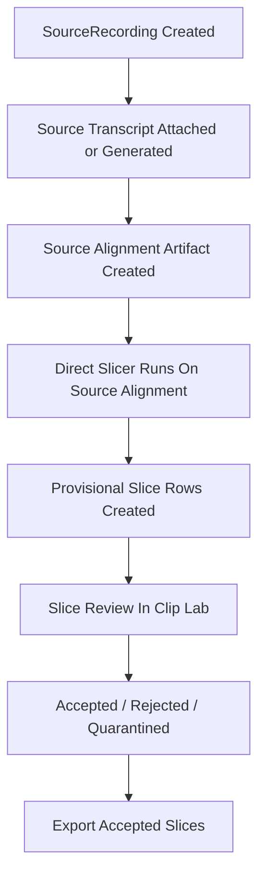

## RFC: Slice-First Refactor

Status:

- Draft for implementation
- This RFC supersedes any earlier plan that still assumes review windows are the primary user-facing review object

Related documents:

- [Slice_First_Backend_UI_Boundaries.md](/home/aaravthegreat/Projects/speechcraft/docs/Slice_First_Backend_UI_Boundaries.md)
- [Slice_First_Refactor_Review_Guide.md](/home/aaravthegreat/Projects/speechcraft/docs/Slice_First_Refactor_Review_Guide.md)
- [Slicer_End_To_End_Review_Guide.md](/home/aaravthegreat/Projects/speechcraft/docs/Slicer_End_To_End_Review_Guide.md)
- [Slicer_Finetuning_Status.md](/home/aaravthegreat/Projects/speechcraft/docs/Slicer_Finetuning_Status.md)

## 1. Summary

Speechcraft currently has two slicer worlds:

1. the old integrated product path
   - coarse slicer handoff
   - review windows
   - review-window ASR
   - review-window forced-align-and-pack
   - slices created later

2. the new tested path
   - source audio
   - source transcript/alignment
   - direct acoustic-first slicer
   - provisional slices imported into Clip Lab

This RFC moves the real codebase to the second model.

The user-facing review surface becomes slices only.

The backend truth becomes:

- `SourceRecording`
- source transcript artifact
- source alignment artifact
- direct slice derivation from source alignment

## 2. Motivation

The current review-window-first product architecture is wrong for the current slicer.

It was built around an older, weaker slicer where humans had to review intermediate windows because the final slice quality was unreliable.

That is no longer true.

The new slicer has already been validated on several datasets by:

- aligning a full recording
- slicing directly from that alignment
- importing the resulting clips into Clip Lab
- reviewing the real training clips by ear

The key product insight is:

- the thing a human should review is the thing the TTS model will train on
- not a temporary review-window abstraction

Benefits of the slice-first refactor:

- removes a large amount of review-window-only backend and frontend state
- makes Clip Lab easier to understand
- aligns the product model with the actual data flow
- makes the current slicer the primary path instead of an experimental sidecar

## 3. Non-Goals

This RFC does not attempt to:

- solve reference-clip selection
- solve automatic best-clip selection
- redesign the inference workflow
- implement a perfect transcript reconciliation engine for arbitrary overlapping edits
- optimize frontend playback architecture in the same PR as the data-model cutover

## 4. Current State

### 4.1 Old Integrated Slicer Path

Current product path:

1. `register_slicer_chunks(...)` creates `ReviewWindow` rows
2. users or jobs interact with review windows
3. `_run_forced_align_and_pack_job(...)` aligns a concatenated review-window transcript
4. old [slicer_core.py](/home/aaravthegreat/Projects/speechcraft/backend/app/slicer_core.py) packs aligned words into slices
5. `_create_slice_from_source_span(...)` materializes slices

Problems:

- review windows are ephemeral but treated like primary entities
- the frontend has dual item logic everywhere
- old slicer logic is text- and punctuation-led
- the product complexity is much larger than the actual data model requires

### 4.2 New Tested Slicer Path

Current validated prototype path:

1. create or reuse source transcript
2. create source alignment
3. run [slicer_algo.py](/home/aaravthegreat/Projects/speechcraft/backend/app/slicer_algo.py)
4. write slicer result JSON
5. temp-import slices into Clip Lab
6. review by ear

This path is currently outside the main repository flow, but it is the behavior we want to integrate.

## 5. Proposed Architecture

### 5.1 Core Data Model

`SourceRecording` remains the immutable timing anchor.

The source recording owns:

- source transcript artifact metadata
- source alignment artifact metadata

`Slice` becomes the only Clip Lab review unit.

Review windows cease to be a primary user-facing concept.

### 5.2 Canonical Flow

### 5.3 Core Invariants

1. `SourceRecording` is the timing anchor.
2. Source transcript/alignment belongs to the recording, not the slice.
3. Clip Lab is slice-only.
4. `training_start` / `training_end` is canonical export truth.
5. Review-safe or padded bounds are never export truth.
6. Human review work must survive reslice.

## 6. Data Model Decisions

### 6.1 Source Artifact Ownership

Decision:

- the database will store artifact metadata and artifact paths
- large transcript/alignment payloads remain on disk or object storage

Rationale:

- reviewers correctly pointed out that the source alignment must survive independently from slices
- storing large alignment JSON inline in hot DB rows is the wrong tradeoff

### 6.2 Dedicated Artifact Object vs Inline Recording Fields

Decision:

- implement a dedicated 1:1 recording artifact object or equivalent table-backed concept
- do not rely only on loose ad hoc fields buried in unrelated metadata blobs

Minimum required fields:

- `source_recording_id`
- `transcript_text_path`
- `transcript_json_path`
- `alignment_json_path`
- `transcript_status`
- `alignment_status`
- `transcript_word_count`
- `alignment_word_count`
- `transcript_updated_at`
- `aligned_at`
- `alignment_backend`
- `alignment_summary`

### 6.3 Slice Locking

Decision:

- add explicit `is_locked` to `Slice`

A slice becomes locked when:

- a user edits transcript text
- a user changes review status away from `unresolved`
- a user explicitly locks it later if such control is added

Rationale:

- preserving human work is non-negotiable
- deriving this only from history is possible but less clear

## 7. Transcript Policy

This was the most disputed reviewer topic.

### 7.1 Rejected Option

Rejected:

- fully automatic, keystroke-level propagation from slice transcript editor back into a long source transcript string

Reason:

- too much state coupling for the first refactor
- easy to corrupt offsets and create reconciliation bugs

### 7.2 Accepted Policy

Accepted:

- slice transcript edits are saved to the slice
- edited slices become locked immediately
- source transcript is updated through a structured patch step, not raw live mirroring

Implementation rule:

- each generated slice must carry source provenance sufficient to identify its source token span
- when a human saves a transcript edit on a slice, the backend patches the source transcript artifact at that source span
- patching the source transcript marks the source alignment artifact as stale

This is the compromise between:

- reviewer demand that human edits must not be lost
- reviewer warning that naive bidirectional text flow is dangerous

### 7.3 Why This Policy

It solves the real bug:

- human slice edits cannot be wiped by reslice
- future source alignment can use corrected text

without requiring:

- live distributed state reconciliation during typing

## 8. Reslice Policy

This was the second major disputed area.

### 8.1 Rejected Option

Rejected:

- gap-filling around locked slices
- trying to weave new slice boundaries around preserved islands

Reason:

- this turns reslice into a constraint solver
- it is mathematically and operationally too complex for the first integrated rollout

### 8.2 Accepted Policy

Accepted:

1. run slicer on the full unbroken source recording and current source alignment
2. generate a fresh full candidate slice set
3. in the database merge phase:
   - keep locked slices
   - drop new generated slices that materially overlap locked slices
   - replace unresolved, unlocked generated slices with the fresh set

### 8.3 Alignment Drift Validation

Additional accepted rule:

- when reslicing after source transcript or alignment changes, existing locked slices must be validated against the new source alignment
- if the underlying alignment drifts beyond threshold relative to the locked slice’s recorded provenance, mark the locked slice with a warning state such as:
  - `alignment_drift_warning`

Do not:

- silently delete the locked slice
- silently pretend nothing changed

This directly addresses the reviewer warning that “accepted” slices can become stale relative to new alignment.

## 9. Slice Generation Contract

The integrated slicer will use:

- source alignment artifact as input
- [slicer_algo.py](/home/aaravthegreat/Projects/speechcraft/backend/app/slicer_algo.py) as the slicer core

For each generated slice, store:

- source recording id
- source word-span provenance
- `raw_*`
- `snapped_*`
- `training_*`
- optional review-safe context metadata
- slicer flags and QC metadata

Canonical truth:

- `training_start`
- `training_end`

Review-only context:

- padded or review-safe bounds

## 10. Backend API Decisions

### 10.1 Clip Lab Endpoint

Decision:

- delete the generic mixed-kind Clip Lab endpoint as the active path
- introduce and use a dedicated slice endpoint

Canonical endpoint:

- `GET /api/slices/{slice_id}/clip-lab`

Rationale:

- there is only one active Clip Lab item kind after this refactor
- keeping a generic route only preserves dead abstraction

### 10.2 Project Queue Endpoint

Decision:

- `GET /api/projects/{project_id}/slices` becomes the only queue-loading endpoint for Clip Lab

Review-window listing no longer participates in Clip Lab loading.

### 10.3 Recording-Level Job Endpoints

Decision:

- processing jobs for ASR, alignment, and slicing are recording-level

Required job types:

- `source_transcription`
- `source_alignment`
- `source_slicing`

Per-slice jobs remain only for slice-level audio processing variants.

## 11. Frontend Decisions

### 11.1 Slice-Only Clip Lab

Decision:

- remove `review_window` from frontend type unions
- remove mixed queue rendering
- remove review-window editor flows

### 11.2 Split / Merge

Reviewers disagreed here.

Decision for first integrated rollout:

- disable split/merge in the slice-first Clip Lab UI

Reason:

- the refactor is already large
- split/merge expands state transitions and test surface
- if the slicer needs help, we should first improve the slicer and review flow before preserving review-window-era surgery controls

This is not a permanent ban.
It is a scope cut for the first integrated slice-first migration.

### 11.3 Debug / Inspector Visibility

Decision:

- expose source-bound provenance, slicer flags, and lock/drift state in the Inspector under an advanced or debug disclosure

Reason:

- operators need to know why a slice is suspect
- this should not clutter the main transport controls

## 12. Playback And Materialization

This was another disputed area.

### 12.1 Export

Decision:

- export remains exact server-side rendering from `(recording_path, training_start, training_end)`

No review-safe or padded bounds may enter the export renderer.

### 12.2 UI Playback

Decision:

- client-side offset playback from the source audio buffer is the target architecture for the UI
- this avoids backend cut/render latency on every play click

However:

- this is not a blocker for PR 1 data-model and backend integration work
- the first integrated rollout may temporarily continue using current slice-backed playback if needed for migration speed

Target end state:

- browser loads or streams source audio
- Clip Lab plays `(review_start, review_end)` offsets directly from the local buffer
- export continues to render exact `training_*` bounds separately

## 13. Migration Plan

### PR 1: Data Model And Artifact Storage

Implement:

- recording-level source artifact model
- `is_locked` on `Slice`
- source transcript/alignment status fields
- initial repository helpers for artifact ownership

### PR 2: Recording-Level Jobs

Implement:

- recording-level ASR contract
- recording-level alignment contract
- recording-level slicing contract

Stop depending on:

- review-window jobs for the new primary path

### PR 3: Direct Slicer Integration

Implement:

- repository path that loads source alignment artifact
- runs [slicer_algo.py](/home/aaravthegreat/Projects/speechcraft/backend/app/slicer_algo.py)
- creates provisional slices directly
- records source word-span provenance for each slice

### PR 4: Reslice Merge

Implement:

- full fresh candidate generation
- locked-slice preservation
- overlap-drop policy for conflicting fresh slices
- alignment drift warning logic

### PR 5: Frontend Collapse

Implement:

- slice-only queue
- dedicated slice Clip Lab endpoint
- remove frontend review-window unions and routes
- disable split/merge
- add advanced inspector provenance/debug panel

### PR 6: Cleanup

Implement:

- remove review-window routes
- remove old review-window tests
- remove old forced-align-and-pack path
- remove old slicer handoff path as primary logic

### PR 7: Playback Optimization

Implement:

- client-side source-buffer playback for Clip Lab review

This is intentionally after the data-model cutover.

## 14. Reviewer Commands Incorporated

The following reviewer directives are explicitly adopted:

- source-level alignment must exist independently from slices
- Clip Lab becomes slice-only
- generic Clip Lab item endpoint is removed as the active API
- recording-level jobs replace review-window jobs
- export must use exact `training_*` truth
- review bounds must remain review-only
- human work must survive reslice
- gap-filling around locked slices is rejected

The following reviewer concerns are addressed via compromise rather than literal adoption:

- transcript propagation
  - not live mirroring during typing
  - yes to structured patching on save

- lazy materialization
  - yes to exact server-side export rendering
  - no to keeping backend render-on-click as the desired UI architecture

## 15. Risks

### Risk 1: Source Transcript Patch Logic

Structured patching of source transcript spans is a real implementation risk.

Mitigation:

- record source token-span provenance at slice generation time
- patch by token span, not by naive raw string search

### Risk 2: Locked Slice Drift

Locked slices may become stale against new alignment.

Mitigation:

- explicit drift validation and warning state

### Risk 3: Hidden Review-Window Dependencies

Frontend and backend may still silently assume review-window types or routes.

Mitigation:

- collapse types early
- remove generic endpoint
- let TypeScript and tests expose all remaining branches

### Risk 4: Playback Performance

Slice-backed playback may remain acceptable for migration, but not ideal long-term.

Mitigation:

- keep the target architecture explicit
- schedule client-side offset playback after the core cutover

## 16. Acceptance Criteria

The slice-first refactor is acceptable only if:

1. a source recording can own transcript and alignment artifacts directly
2. the integrated slicer can create slices directly from source alignment
3. Clip Lab can review slices without review-window APIs or types
4. any human-edited or human-triaged slice survives reslice
5. source transcript corrections are not lost across reslice
6. export uses exact `training_start` / `training_end`
7. review-safe bounds cannot affect export output

## 17. Immediate Next Step

Proceed with PR 1:

- schema and model changes for source artifacts and slice locking
- repository groundwork for artifact ownership

Do not start frontend deletion before those primitives exist.
