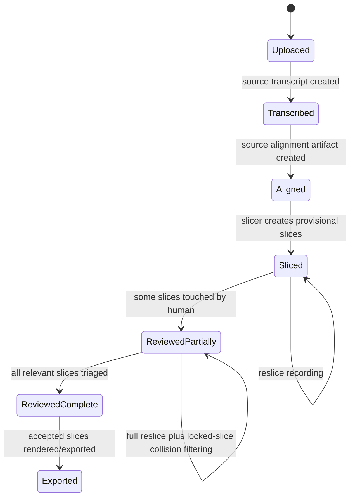

## Purpose

This document freezes the backend-frontend contract for the slice-first refactor.

It exists to stop the refactor from drifting while code is being moved.
If implementation code violates this document, the code is wrong unless this document is explicitly updated first.

This is the contract that should be reviewed before the old review-window pipeline is removed.

## Scope

This document covers:

- source recording state
- source transcript/alignment storage
- recording-level processing jobs
- slice generation and replacement
- Clip Lab item loading
- project queue loading
- export semantics
- reslice semantics
- deleted APIs and deleted frontend states

It does not describe the internals of the acoustic slicer algorithm itself.
That is documented in:

- [Slicer_End_To_End_Review_Guide.md](/home/aaravthegreat/Projects/speechcraft/docs/Slicer_End_To_End_Review_Guide.md)
- [Slicer_Finetuning_Status.md](/home/aaravthegreat/Projects/speechcraft/docs/Slicer_Finetuning_Status.md)

## Architectural Decision

Clip Lab is slice-only.

The review-window workflow is removed as a user-facing concept.

The new product flow is:

1. create `SourceRecording`
2. create or attach source transcript
3. create or attach source alignment artifact
4. run slicer against source alignment
5. create provisional `Slice` rows directly
6. review slices in Clip Lab
7. export accepted slices

The old flow:

1. register slicer chunks
2. create review windows
3. run ASR/alignment on review windows
4. forced-align and pack review windows into slices

is deprecated and should be removed.

## Core Invariants

These invariants are mandatory.

1. `SourceRecording` is the canonical timing anchor.
2. Source-level transcript/alignment is recording-level data, not slice-level data.
3. `Slice` is the only reviewable Clip Lab unit.
4. `training_start` / `training_end` is the only canonical export boundary truth.
5. Review/audition context must never silently become export truth.
6. Transcript edits made inside a slice are first-class human corrections and must not be lost across reslice.
7. Reslicing must not silently destroy human-reviewed slices.

## State Model

### Source Recording State

A recording moves through these states:

- `uploaded`
- `transcribed`
- `aligned`
- `sliced`
- `reviewed_partially`
- `reviewed_complete`
- `exported`

Suggested state transition diagram:



### Slice Review State

Slice review status remains:

- `unresolved`
- `accepted`
- `rejected`
- `quarantined`

Additional policy meaning:

- `accepted`, `rejected`, or any slice with human transcript edits is considered `locked` for reslicing purposes
- `unresolved` and untouched slices are replaceable by reslice

This `locked` concept can be implemented either:

- as an explicit DB field
- or as a derived policy based on edit/status history

Implementation preference:

- explicit `is_locked` is clearer for both code and reviewers

## Source-Level Data Contract

The recording layer must own these artifacts:

- source transcript text
- source transcript artifact path
- source alignment artifact path
- source alignment status
- source alignment metadata summary

The actual full alignment JSON should not be stored inline in a DB text field.

Policy:

- DB stores metadata and artifact paths
- file system or object storage stores the large JSON payload
- full alignment JSON is only loaded when needed for slicing or deep inspection

### Proposed Recording-Level Artifact Shape

This can be implemented as a new table or equivalent repository-owned artifact model.

Recommended conceptual shape:

```json
{
  "recording_id": "src_123",
  "transcript_text_path": "/abs/path/transcript.txt",
  "transcript_json_path": "/abs/path/transcript.json",
  "alignment_json_path": "/abs/path/alignment.json",
  "transcript_status": "ok",
  "alignment_status": "ok",
  "transcript_word_count": 2764,
  "alignment_word_count": 2764,
  "aligned_at": "2026-04-04T15:00:00Z",
  "alignment_backend": "torchaudio_forced_align_worker",
  "alignment_summary": {
    "segment_count": 149,
    "processed_segments": 149,
    "skipped_segments": 0
  }
}
```

## Recording-Level Processing Jobs

Processing jobs move from review-window scope to recording scope.

Required recording-level jobs:

- `source_transcription`
- `source_alignment`
- `source_slicing`

Optional later:

- `reference_generation`
- `bulk_auto_accept`

Job scope rules:

- ASR runs on `SourceRecording`
- alignment runs on `SourceRecording`
- slicing runs on `SourceRecording`
- denoise/model variants still run on individual `Slice`

## Backend API Contract

### Project Slice List

Primary list endpoint:

- `GET /api/projects/{project_id}/slices`

This becomes the only queue-loading endpoint used by Clip Lab.

Response shape:

```json
[
  {
    "id": "slice_001",
    "source_recording_id": "src_001",
    "active_variant_id": "variant_001",
    "active_commit_id": "commit_001",
    "status": "unresolved",
    "duration_seconds": 7.84,
    "created_at": "2026-04-04T15:00:00Z",
    "model_metadata": {
      "order_index": 0,
      "slice_origin": "source_slicer",
      "source_bounds": {
        "raw_start": 12.44,
        "raw_end": 19.98,
        "snapped_start": 12.41,
        "snapped_end": 19.93,
        "training_start": 12.41,
        "training_end": 19.93,
        "training_start": 12.41,
        "training_end": 19.93
      },
      "slicer_boundary_type": "safe_gap",
      "slicer_flag_reasons": ["high_end_edge_energy_0.71"],
      "is_locked": false
    },
    "transcript": {
      "id": "transcript_001",
      "slice_id": "slice_001",
      "original_text": "hello there how are you",
      "modified_text": null,
      "is_modified": false
    },
    "tags": [],
    "active_variant_generator_model": "slicer",
    "can_undo": false,
    "can_redo": false
  }
]
```

Contract notes:

- No review-window records appear here.
- `model_metadata` may contain slicer provenance and flags.
- Frontend must not parse `model_metadata` as mandatory schema except for explicitly documented keys.

### Clip Lab Slice Detail

New dedicated endpoint:

- `GET /api/slices/{slice_id}/lab`

This replaces the generic `GET /api/clip-lab-items/{kind}/{id}` endpoint for active Clip Lab usage.

Response shape:

```json
{
  "id": "slice_001",
  "kind": "slice",
  "source_recording_id": "src_001",
  "source_recording": {
    "id": "src_001",
    "batch_id": "project_001",
    "sample_rate": 48000,
    "num_channels": 2,
    "num_samples": 45120000,
    "processing_recipe": "original"
  },
  "start_seconds": 12.41,
  "end_seconds": 19.93,
  "duration_seconds": 7.52,
  "status": "unresolved",
  "created_at": "2026-04-04T15:00:00Z",
  "transcript": {
    "id": "transcript_001",
    "original_text": "hello there how are you",
    "modified_text": null,
    "is_modified": false,
    "alignment_data": {
      "source": "source_slicer",
      "raw_start": 12.44,
      "raw_end": 19.98,
      "snapped_start": 12.41,
      "snapped_end": 19.93,
      "training_start": 12.41,
      "training_end": 19.93,
      "training_start": 12.41,
      "training_end": 19.93,
      "boundary_type": "safe_gap",
      "flag_reasons": [],
      "words": []
    }
  },
  "tags": [],
  "speaker_name": "speaker_a",
  "language": "en",
  "audio_url": "/media/clips/slice_001.wav",
  "item_metadata": {
    "source_alignment_status": "ok",
    "is_locked": false
  },
  "transcript_source": "slice_transcript",
  "can_run_asr": false,
  "asr_placeholder_message": null,
  "active_variant_generator_model": "slicer",
  "can_undo": false,
  "can_redo": false,
  "capabilities": {
    "can_edit_transcript": true,
    "can_edit_tags": true,
    "can_set_status": true,
    "can_save": true,
    "can_split": false,
    "can_merge": false,
    "can_edit_waveform": true,
    "can_run_processing": true,
    "can_switch_variants": true,
    "can_export": false,
    "can_finalize": false
  },
  "variants": [],
  "commits": [],
  "active_variant": null,
  "active_commit": null
}
```

Contract decisions:

- `kind` remains `"slice"` for explicitness, but there is no union type anymore in the frontend.
- `can_split` and `can_merge` are disabled for now.
- `can_run_asr` is false in Clip Lab because ASR is recording-level.

### Deleted / Deprecated Endpoints

These should be removed from active use:

- `GET /api/projects/{project_id}/review-windows`
- `GET /api/clip-lab-items/{item_kind}/{item_id}` for `review_window`
- all `/api/review-windows/...` mutation endpoints
- `POST /api/recordings/{id}/slicer-chunks`
- review-window ASR endpoints and handlers

Migration note:

- during transition, old routes can return `410 Gone` or remain temporarily unused
- frontend must stop depending on them first

## Frontend State Contract

### Queue State

Frontend queue contains only slices.

This means:

- no `ClipLabItemKind` union
- no mixed `activeClipItem`
- no queue merging of slices and review windows

Recommended type direction:

- replace `ClipLabItemKind = "slice" | "review_window"` with slice-only types
- replace `ClipLabItemRef` with `SliceRef`

### Pagination / Virtualization

Pagination is a frontend performance concern only.

The backend returns a continuous ordered list of slices.
The slicer never knows anything about pagination.

### Inspector / Provenance Visibility

The frontend should show:

- slicer flags
- canonical training bounds
- source recording id
- locked status

It should not pretend that review-safe bounds are training truth.

## Reslice Policy

This is the hardest contract in the refactor.

### Required Rule

Reslicing must not silently destroy human work.

### Slice Lock Rule

A slice is `locked` if any of these is true:

- transcript modified by human
- status changed from `unresolved`
- explicit lock toggle set

### Reslice Behavior

When reslicing a recording:

- run the slicer on the full unbroken source recording and current source alignment
- generate a fresh full candidate slice set
- preserve locked slices
- drop fresh generated slices that materially overlap locked slices
- replace unresolved unlocked slices with the remaining fresh generated slices
- mark locked slices with drift warnings if source alignment moved materially beneath them

Minimum acceptable first implementation:

- preserve locked slices
- replace unresolved unlocked slices
- do not attempt to stitch new slices around locked slices
- record reslice run metadata in `model_metadata`

Anything weaker than this is not acceptable.

## Transcript Ownership Policy

This is explicitly decided:

- source transcript belongs to the recording
- slice transcript belongs to the slice
- human slice transcript edits are preserved locally on the slice and also patched back into the source transcript artifact through a structured patch step
- source alignment is marked stale after such a patch until re-aligned

Reason:

- pure local-only edits risk losing corrected text on future source alignment runs
- live keystroke-level bidirectional propagation is too fragile
- structured patch-on-save is the compromise

## Materialization Policy

Physical WAVs for slices should not be lazily backend-rendered on the critical UI playback path.

Preferred rule:

- slicer creates DB rows with bounds
- Clip Lab playback should eventually use client-side offset playback from source audio
- export renders exact `training_*` bounds server-side

If current implementation still writes or serves per-slice audio for playback during migration, that is tolerated only as a transitional implementation detail, not the target contract.

## Export Contract

Export remains slice-based.

Rules:

- export accepted slices only
- export from canonical slice truth
- canonical truth means `training_start` / `training_end`
- do not export from `padded_*` or review-safe bounds

The API does not distinguish between “fast path slices” and “slow path slices”.

A slice is a slice.
Fast-path is only an export/selection policy layered on top.

## Boundary Matrix

| Boundary | Contract |
|---|---|
| Source transcript ownership | Recording-level |
| Source alignment ownership | Recording-level artifact |
| Clip review unit | Slice only |
| Clip Lab detail endpoint | `/api/slices/{id}/lab` |
| Queue loading | slices only |
| Processing job scope | recording-level for ASR/alignment/slicing |
| Slice transcript edits | local to slice |
| Split / merge | removed for now |
| Export truth | `training_*` only |
| Review-only extension | UI/audition only |
| Reslice replacement | unresolved unlocked slices only |

## Open Questions To Keep On Review Surface

These are implementation-shaping decisions and must stay visible:

1. Should `locked` be explicit DB state or derived from history?
2. What exact overlap threshold should trigger a locked-slice collision drop or drift warning?
3. Should lazy materialization be done in the same refactor, or immediately after?
4. Should inspector show all canonical bounds by default, or behind an advanced disclosure control?

## Reviewer Checklist

Before merge, a reviewer should be able to confirm:

- no active frontend path depends on review-window types or routes
- Clip Lab loads slices only
- recording-level alignment artifact exists separately from slices
- export still uses accepted slices only
- `training_*` remains the only export truth
- reslice does not delete human-reviewed slices
- ASR/alignment/slicing jobs are recording-level, not review-window-level
- generic item endpoint is no longer the main active Clip Lab contract
