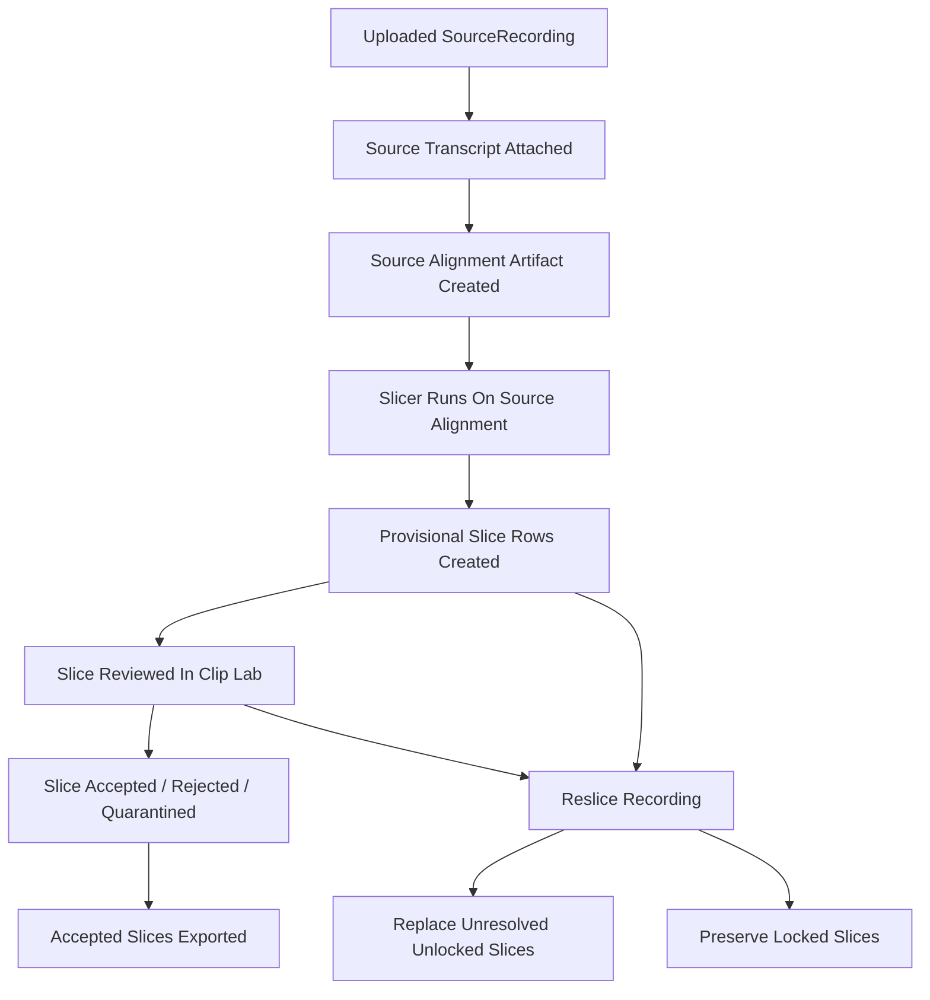

## Goal

This document is the reviewer packet for the slice-first refactor.

It is written for a reviewer who has not seen the Speechcraft codebase before.

Use this together with:

- [Slice_First_Backend_UI_Boundaries.md](/home/aaravthegreat/Projects/speechcraft/docs/Slice_First_Backend_UI_Boundaries.md)
- [Slicer_End_To_End_Review_Guide.md](/home/aaravthegreat/Projects/speechcraft/docs/Slicer_End_To_End_Review_Guide.md)

## One-Screen Summary

### Old World

The old codebase assumes:

1. a coarse slicer creates review windows
2. humans review windows
3. ASR/alignment can run on windows
4. a packer creates canonical slices later

This made sense when the slicer was weak and the UI had to compensate.

### New World

The new codebase should assume:

1. source recording is the timing anchor
2. source transcript and source alignment belong to the recording
3. the slicer runs directly on source alignment
4. the slicer creates `Slice` rows directly
5. Clip Lab reviews slices only
6. export uses accepted slices only

## Why This Refactor Exists

The current tested slicer is materially better than the old one.

The team validated it by:

- running alignment on long recordings
- running the new acoustic-first slicer
- importing provisional slices into Clip Lab
- reviewing the actual training clips by ear

That produced better results than the review-window-first path.

The product insight is:

- humans should review the actual training clips
- not an abstract intermediate review-window object

## What Is Being Kept

These concepts survive:

- `SourceRecording` as canonical source object
- `Slice` as review/export unit
- transcript editing, tags, status, commits, variants, export
- source-relative provenance in slice metadata
- recording-level ASR/alignment workers
- the new acoustic-first slicer in [slicer_algo.py](/home/aaravthegreat/Projects/speechcraft/backend/app/slicer_algo.py)

## What Is Being Deleted

These concepts are being removed from the active product path:

- review-window queue in Clip Lab
- review-window editor path
- review-window ASR flow
- review-window forced-align-and-pack flow
- review-window API endpoints as the normal UI path
- old slicer handoff registration as the canonical flow

## Why This Is Safe To Do

The key enabling fact is:

- the slicer is now good enough that the slice itself is the reviewable object

If the slicer were still weak, this refactor would be premature.
It is only happening because the new slicer already performed well on multiple datasets.

## Main Risks

### Risk 1: Source Truth Gets Lost

If transcript/alignment truth is stored only inside slices, reslicing becomes fragile and expensive.

Mitigation:

- store source transcript/alignment as recording-level artifacts

### Risk 2: Human Work Gets Deleted Or Desynchronized On Reslice

If reslicing replaces every slice blindly, manually reviewed clips get destroyed.

Mitigation:

- locked-slice policy
- full fresh reslice followed by overlap-drop against locked slices
- drift-warning validation for preserved locked slices

### Risk 3: Review Bounds Leak Into Export Truth

If review-safe or padded bounds are treated as canonical, exported clips can pick up transient junk.

Mitigation:

- `training_*` is export truth
- review/audition bounds remain UI-only

### Risk 4: Frontend Still Secretly Depends On Review Windows

Even if review-window UI disappears visually, hidden branching may remain.

Mitigation:

- remove union item type
- remove review-window route usage
- remove mixed queue behavior

## Code Areas To Review

### New Slicer Path

- [slicer_algo.py](/home/aaravthegreat/Projects/speechcraft/backend/app/slicer_algo.py)
- [evaluate_slicer_algo.py](/home/aaravthegreat/Projects/speechcraft/backend/scripts/evaluate_slicer_algo.py)
- [align_existing_segments.py](/home/aaravthegreat/Projects/speechcraft/backend/scripts/align_existing_segments.py)
- [import_provisional_slicer_batch.py](/home/aaravthegreat/Projects/speechcraft/backend/scripts/import_provisional_slicer_batch.py)

### Old Review-Window Path To Remove

- [slicer_core.py](/home/aaravthegreat/Projects/speechcraft/backend/app/slicer_core.py)
- [repository.py](/home/aaravthegreat/Projects/speechcraft/backend/app/repository.py)
  around `register_slicer_chunks`
  and `_run_forced_align_and_pack_job`
- [main.py](/home/aaravthegreat/Projects/speechcraft/backend/app/main.py)
  review-window routes
- [types.ts](/home/aaravthegreat/Projects/speechcraft/frontend/src/types.ts)
- [ClipQueuePane.tsx](/home/aaravthegreat/Projects/speechcraft/frontend/src/workspace/ClipQueuePane.tsx)
- [LabelPage.tsx](/home/aaravthegreat/Projects/speechcraft/frontend/src/pages/LabelPage.tsx)

## State Transition Diagram

## Required Reviewer Questions

A reviewer should be able to answer these without guessing:

1. Where does source transcript truth live now?
2. Where does source alignment truth live now?
3. What exact endpoint powers Clip Lab after the refactor?
4. Does any active frontend path still use review-window types or routes?
5. What happens to manually reviewed slices on reslice?
6. What exact bounds are used for export?
7. Are ASR/alignment/slicing jobs recording-level now?

If the answer to any of these is fuzzy, the implementation is not ready.

## Required Implementation Rules

These come directly from review feedback and are not optional.

1. Recording-level source alignment artifact must exist separately from slices.
2. Human slice transcript edits must survive future source alignment and reslice operations.
3. Clip Lab item type collapses to slice-only.
4. Generic mixed-kind item loading should not remain the primary contract.
5. Split/merge should be removed for now, not preserved automatically.
6. Processing jobs for ASR/alignment/slicing are recording-level.
7. Reslice must preserve human-reviewed slices.

## Staged Implementation Plan

The reviewer should expect the refactor to land in this order:

### PR 1: Data Model And Artifact Storage

- add recording-level source transcript/alignment artifact support
- add or define locked-slice policy
- no major frontend deletion yet

### PR 2: Recording-Level Workers

- move ASR/alignment/slicing contracts to recording-level
- stop depending on review-window jobs

### PR 3: Integrated Direct Slicer

- wire [slicer_algo.py](/home/aaravthegreat/Projects/speechcraft/backend/app/slicer_algo.py) into repository/backend
- create slices directly from source-level alignment
- keep export semantics correct
- record source token/span provenance needed for transcript patching and drift checks

### PR 4: Frontend Collapse

- remove review-window loading
- remove mixed item typing
- Clip Lab becomes slice-only
- disable split/merge in the first integrated rollout

### PR 5: Cleanup

- delete dead review-window endpoints
- delete obsolete tests
- remove old slicer handoff paths

## Reviewer Focus Areas Per Stage

### PR 1

- are artifact paths and statuses modeled cleanly?
- is full alignment JSON kept out of hot project-list paths?

### PR 2

- are jobs correctly recording-scoped?
- is there any hidden review-window dependency left in workers?

### PR 3

- are slices created from `training_*` truth?
- is source provenance retained?
- does reslice behavior preserve locked slices?

### PR 4

- is review-window UI actually gone?
- are queue selection and item detail logic truly slice-only?

### PR 5

- are deleted routes/tests genuinely obsolete?
- did cleanup remove logic or remove safety?

## Anti-Patterns To Reject In Review

Reject the refactor if you see any of these:

- review-window code merely hidden instead of removed
- full alignment JSON dumped into a hot DB text field
- slice transcript edits that can be silently lost on reslice or future alignment runs
- export using padded or review-safe bounds
- reslice deleting accepted/rejected or human-edited slices
- generic item routes still doing mixed-kind branching as the main path
- swallowed errors in processing jobs

## Minimal Acceptance Criteria

The refactor is acceptable only if:

- one source recording can be aligned and sliced directly into slices
- Clip Lab can review those slices without review-window APIs
- accepted slices export correctly
- reslicing does not destroy human-reviewed slices
- source alignment remains reusable without rerunning alignment every time
